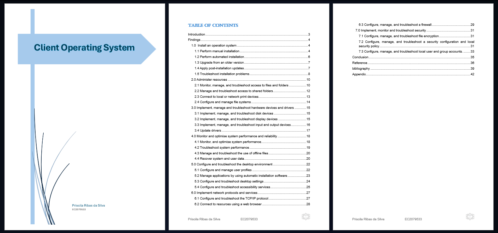
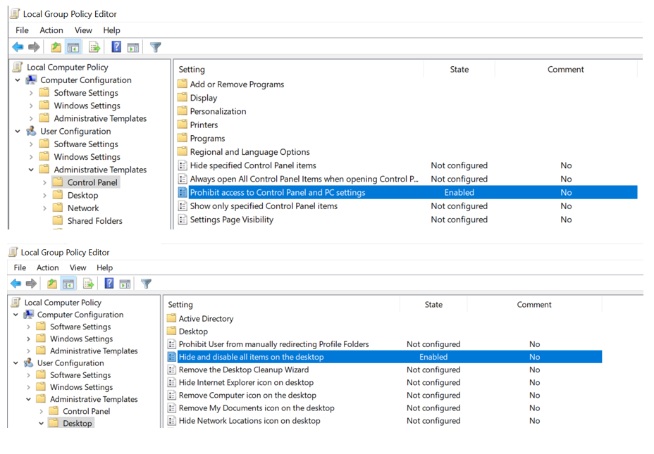
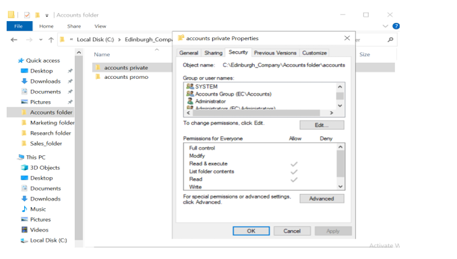

<h1> <a href="https://github.com/prsilvaa"> Windows Operating System Administration </a></h1>

<h2>Project Objective</h2>

To install, configure, and manage Windows operating systems, including manual and automated installations, upgrading, troubleshooting, resource administration, hardware management, performance optimization, desktop environment configuration, network services, and security implementation.

<h2>Tools Used</h2>
<ul>
    <li>Windows OS</li>
    <li>PowerShell</li>
    <li>Group Policy</li>
    <li>Disk Management</li>
    <li>Firewall</li>
</ul>

<h2>Skills Gained</h2>
<ul>
    <li>OS Installation</li>
    <li>Resource Management</li>
    <li>Hardware Troubleshooting</li>
    <li>Performance Tuning</li>
    <li>Network Configuration</li>
    <li>Security Management</li>
</ul>

<h2>Outcome</h2>

Successfully implemented a full lifecycle of Windows OS management tasks, from installation and upgrades to security configuration and troubleshooting, enhancing skills in system administration and support.

    <h3>Client Operating System Overview</h3>
    
    
Screenshot showing all installed, configured, and troubleshooting services.

    <h3>Local Security Policy</h3>
    
    
Configuring policies to restrict user access and protect system settings.

    <h3>Troubleshooting Network Access</h3>
    
    
Troubleshooting network paths and permission.

